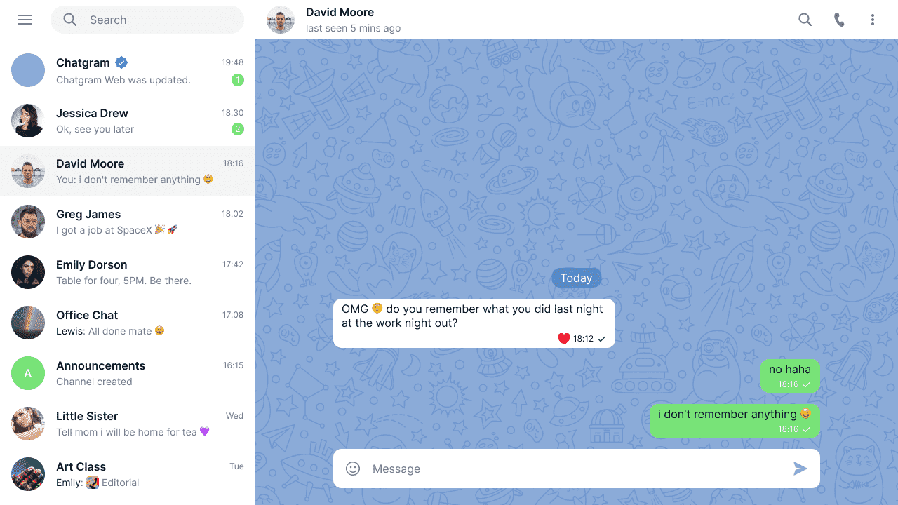

> **Autor** >> Lucas Manoguerra
> **Porfolio** >> https://rocketdev.vercel.app
> **LinkedIn** >> https://www.linkedin.com/in/lucas-r-manoguerra/

# Chat web app

**preview**


aplicacion cliente creada en [next.js](https://nextjs.org/)

podras probar esta aplicacion tanto de forma local con **docker-compose** como de forma remota accediendo [aca.](https://chat-app-telegrap.vercel.app/)

> para levantar el proyecto de forma local previamente deveras terner instalado **docker** como **docker-compose**
> install docker [aca](https://www.docker.com/)

#### levanatando el poyecto

Este poceso puede demorar dependiendo de tu conexion de internet

```bash
docker-compose up --build # este comando construira nuestro comntenedor
# and
docker-compose up # este comando levantara nuetro poyecto en el puesto ???
```

